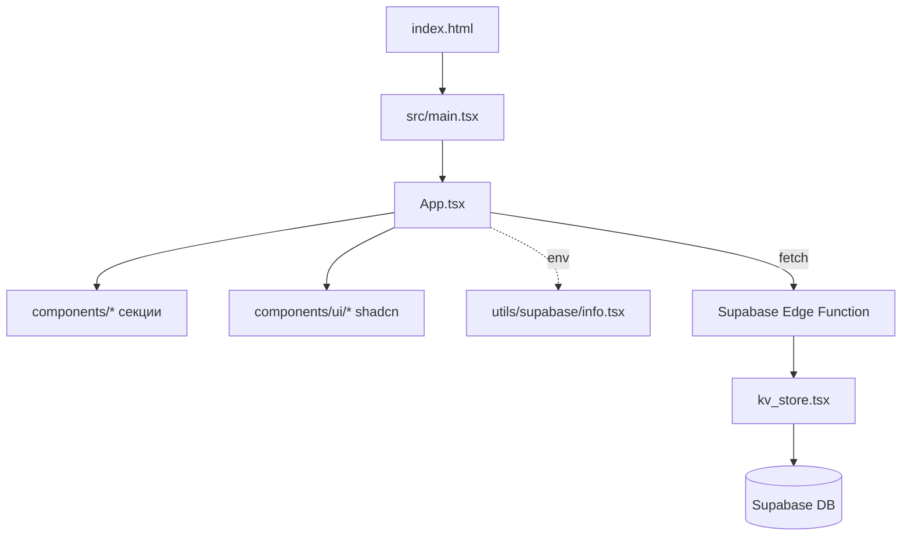

# Архитектура проекта — Бардабар

Последнее обновление: 2025-12-15

---

## Технологический стек

- **Frontend**: React 18 + TypeScript + Vite
- **Стилизация**: Tailwind CSS + shadcn/ui (Radix UI), lucide-react, sonner
- **Backend**: Supabase Edge Functions (Hono + Deno)
- **Тестирование**: Playwright E2E
- **Линтинг**: ESLint + Prettier
- **Деплой**: Railway (bardabarv6-production.up.railway.app)

---

## Структура проекта

```
├── App.tsx                    # Корневой компонент (монолит ~1500 строк)
├── src/
│   └── main.tsx               # Entry point
├── components/
│   ├── ui/                    # shadcn/ui компоненты
│   ├── figma/                 # Figma-компоненты
│   ├── TableReservation.tsx   # Бронирование столиков
│   ├── Events.tsx             # Мероприятия
│   ├── EventBooking.tsx       # Бронирование мероприятий
│   ├── EventPayment.tsx       # Оплата мероприятий
│   ├── Menu.tsx               # Меню
│   ├── AdminPanel.tsx         # Админ-панель
│   ├── BookingManagement.tsx  # Управление бронированиями
│   └── ...
├── utils/supabase/
│   └── info.tsx               # Supabase credentials из env
├── supabase/functions/server/
│   ├── index.tsx              # Hono API endpoints
│   └── kv_store.tsx           # KV-хранилище
├── tests/e2e/                 # Playwright тесты
├── styles/globals.css         # Глобальные стили
└── guidelines/                # Документация
```

---

## Точки входа

1. **index.html** → подключает `/src/main.tsx`
2. **src/main.tsx** → монтирует `<App />` в DOM
3. **App.tsx** → организует все секции через useState (без роутинга)
4. **supabase/functions/server/index.tsx** → REST API на Hono

---

## API Endpoints

База: `https://{projectId}.functions.supabase.co/server/make-server-c85ae302`

| Метод | Endpoint | Описание |
|-------|----------|----------|
| POST | `/reservations` | Создать бронирование столика |
| GET | `/reservations` | Получить все бронирования |
| PATCH | `/reservations/:id` | Обновить статус |
| POST | `/event-bookings` | Забронировать мероприятие |
| POST | `/process-payment` | Обработать платёж |
| GET | `/notifications` | Получить уведомления |
| PATCH | `/notifications/:id` | Отметить прочитанным |
| GET/POST | `/email-settings` | Настройки email |
| POST | `/init-events` | Инициализация событий |

---

## Схема архитектуры



---

## Демо-режим

При недоступности Supabase (статус 540 или сетевые ошибки) приложение автоматически переходит в демо-режим:
- Данные сохраняются в localStorage
- Пользователь видит уведомление о демо-режиме
- Функциональность сохраняется для демонстрации

---

## Известные проблемы архитектуры

| Проблема | Влияние | Решение |
|----------|---------|---------|
| Монолитный App.tsx (~1500+ строк) | Сложность поддержки | Декомпозиция на секции |
| Нет React Router | Нет истории браузера, прямых ссылок | Внедрить react-router-dom |
| Дублирование кода (телефон в 4+ местах) | Риск рассинхронизации | Создать usePhoneInput хук |
| Прямые fetch-вызовы | Дублирование URL/headers | Создать API-слой |
| Использование `any` | Слабая типизация | Строгие типы |

---

## Рекомендуемая структура после рефакторинга

```
src/
├── api/                    # Централизованный API-клиент
├── components/
│   ├── layout/             # Header, Footer, MainLayout
│   ├── sections/           # HeroSection, GallerySection...
│   ├── forms/              # BookingForm, ContactForm...
│   ├── cards/              # MenuCard, EventCard...
│   └── ui/                 # shadcn/ui
├── hooks/                  # usePhoneInput, useApi, useBookingForm
├── stores/                 # Zustand сторы
├── types/                  # TypeScript типы
├── data/                   # Статические данные
├── pages/                  # Страницы (роуты)
└── utils/                  # Утилиты
```

---

## Примеры кода для рефакторинга

### API-клиент

```typescript
// src/api/client.ts
const API_BASE = `https://${projectId}.functions.supabase.co/server/make-server-c85ae302`;

export async function apiRequest<T>(endpoint: string, options?: RequestInit): Promise<T> {
  const response = await fetch(`${API_BASE}${endpoint}`, {
    ...options,
    headers: {
      'Content-Type': 'application/json',
      'Authorization': `Bearer ${publicAnonKey}`,
      ...options?.headers,
    },
  });
  
  if (response.status === 540) throw new ProjectPausedError();
  if (!response.ok) throw new ApiError(response.status, await response.text());
  
  return response.json();
}
```

### Хук для телефона

```typescript
// src/hooks/usePhoneInput.ts
export function usePhoneInput(initialValue = '') {
  const [value, setValue] = useState(initialValue);
  
  const handleChange = (e: React.ChangeEvent<HTMLInputElement>) => {
    setValue(formatPhoneNumber(e.target.value));
  };
  
  const isValid = value.replace(/\D/g, '').length >= 11;
  
  return { value, onChange: handleChange, isValid };
}
```

### Zustand стор

```typescript
// src/stores/bookingsStore.ts
export const useBookingsStore = create<BookingsState>((set) => ({
  bookings: [],
  isLoading: false,
  fetchBookings: async () => {
    set({ isLoading: true });
    const data = await api.getBookings();
    set({ bookings: data, isLoading: false });
  },
}));
```

---

## Метрики успеха рефакторинга

- [ ] App.tsx < 200 строк
- [ ] 0 использований `any`
- [ ] Покрытие unit-тестами > 60%
- [ ] Lighthouse Performance > 90
- [ ] Lighthouse Accessibility > 95
- [ ] Bundle size < 500KB (gzipped)
